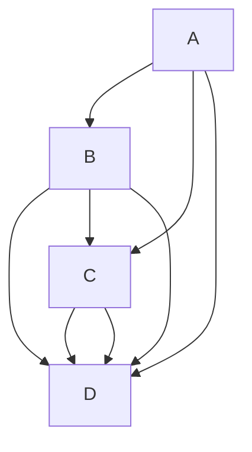

# Comprehensive README Example

Welcome to the Comprehensive README Example! This document showcases various Markdown features for creating detailed and organized documentation.

## Table of Contents

- [Headers](#headers)
- [Emphasis](#emphasis)
- [Lists](#lists)
- [Links](#links)
- [Images](#images)
- [Blockquotes](#blockquotes)
- [Code Blocks](#code-blocks)
- [Horizontal Rule](#horizontal-rule)
- [Tables](#tables)
- [Task Lists](#task-lists)
- [Escaping Markdown](#escaping-markdown)
- [Inline Links](#inline-links)
- [Reference-style Links](#reference-style-links)
- [Automatic Links](#automatic-links)
- [Emphasis and Strong Combined](#emphasis-and-strong-combined)
- [Nested Lists](#nested-lists)
- [Strikethrough](#strikethrough)
- [Fenced Code Blocks without Language](#fenced-code-blocks-without-language)
- [Tables with Alignment](#tables-with-alignment)
- [Definition Lists](#definition-lists)
- [Blockquotes with Multiple Paragraphs](#blockquotes-with-multiple-paragraphs)
- [Footnotes](#footnotes)
- [Superscript and Subscript](#superscript-and-subscript)
- [Abbreviations](#abbreviations)
- [Inline HTML](#inline-html)
- [Task Lists with Nested Items](#task-lists-with-nested-items)
- [Math Equations](#math-equations)
- [Definition Lists with Code Blocks](#definition-lists-with-code-blocks)
- [Admonition Blocks](#admonition-blocks)
- [Definition Lists with Multiple Terms](#definition-lists-with-multiple-terms)
- [Line Breaks](#line-breaks)
- [Comments](#comments)
- [Escaping HTML and Markdown](#escaping-html-and-markdown)
- [Automatic Table of Contents](#automatic-table-of-contents)
- [Custom IDs for Headers](#custom-ids-for-headers)
- [Emoji](#emoji)
- [Line Highlighting in Code Blocks](#line-highlighting-in-code-blocks)
- [Superscript and Subscript in URLs](#superscript-and-subscript-in-urls)
- [Task Lists with Descriptions](#task-lists-with-descriptions)
- [Mention Users and Teams (GitHub)](#mention-users-and-teams)
- [Checkboxes with Formatting](#checkboxes-with-formatting)
- [Citations](#citations)
- [Subsections within Headers](#subsections-within-headers)
- [Strikethrough within Inline Code](#strikethrough-within-inline-code)
- [Custom CSS Classes](#custom-css-classes)
- [Keyboard Input](#keyboard-input)
- [Definition List with Nested Elements](#definition-list-with-nested-elements)
- [Disallowed Raw HTML](#disallowed-raw-html)
- [Mermaid Diagrams](#mermaid-diagrams)
- [Glossary](#glossary)
- [Centered Content](#centered-content)
- [Block Separators](#block-separators)
- [Fenced Div Blocks](#fenced-div-blocks)
- [Audio and Video Embedding](#audio-and-video-embedding)

## Headers

Use `#` for headers. The number of `#` symbols represents the header level.

```markdowns
# Header 1

## Header 2

### Header 3
```

## Emphasis

Use `*` or`_`for italic and `** `or `__` for bold text.

_italic_ or _italic_
**bold** or **bold**

## Lists

Use numbers for ordered lists and dashes for unordered lists.

Ordered List:

1. First item
2. Second item

Unordered List:

- Item 1
- Item 2

## Links

Enclose link text in brackets `[ ]` and the URL in parentheses `( )`.
[Google](https://www.google.com)

## Images

Similar to links, but with an exclamation mark in front.


## Blockquotes

Use `> `for blockquotes.

> This is a blockquote.

## Code Blocks

For inline code, use single backticks. For code blocks, use triple backticks with a language specifier.
Inline code: `code`

Code block:

```python
def hello():
    print("Hello, world!")
```

```js
console.log("Hello World");
```

## Horizontal Rule

---

## Tables

Construct tables using pipes `|` and hyphens `-`.
| Header 1 | Header 2 |
| -------- | -------- |
| Content 1| Content 2|

## Task Lists

Use `- [ ]` for an incomplete task and `- [x]` for a completed task.

- [ ] Task 1
- [x] Task 2

## Escaping Markdown

Use a backslash `\` to escape characters that have special meaning.
\*literal asterisks\*

## Inline Links

Create links with custom display text.
[Visit Google](https://www.google.com)

## Reference-style Links

Define link references for cleaner content.
This is [Google][1].
[1]: https://www.google.com

## Automatic Links

URLs will be automatically converted into links.
Visit https://www.facebook.com

## Emphasis and Strong Combined

Combine emphasis and strong emphasis for varied formatting.
**_Emphasis and Strong_** or **_Emphasis and Strong_**

## Nested Lists

You can create nested lists for organized content.

- Main item
  1. Sub-item 1
  2. Sub-item 2
- Other List
  1. item 1
  2. item 2

## Strikethrough

Use `~~` to strike through text.
~~This text is strikethrough.~~

## Fenced Code Blocks without Language

You can also create code blocks without specifying a language.

```
This is a code block
```

## Tables with Alignment

Align columns using colons in the header row.
| Left-aligned | Center-aligned | Right-aligned |
| :--- | :---: | ---: |
| Content | Content | Content |

## Definition Lists

Create definition lists using colons.
Term 1
: Definition 1
Term 2
: Definition 2

## Blockquotes with Multiple Paragraphs

Include multiple paragraphs within a blockquote.

> This is a blockquote with multiple paragraphs.
>
> Paragraph 2.

## Footnotes

Add footnotes for additional information[^1].
Text with a footnote[^1].
[^1]: This is a footnote.

## Superscript and Subscript

Create superscript and subscript text.
This is a ^superscript^
and this is a ~subscript~.

## Abbreviations

Define abbreviations for better readability.
This is an HTML <abbr title="HyperText Markup Language">abbreviation</abbr>.

## Inline HTML

You can use inline HTML for more complex formatting.

<div style="color: blue;">This text is blue.</div>

## Task Lists with Nested Items

Create task lists with nested items.

- [x] Main task
  - [ ] Sub-task 1
  - [x] Sub-task 2

## Math Equations

If supported, you can render math equations using LaTeX syntax.
This is an inline equation \(x = \frac{-b \pm \sqrt{b^2-4ac}}{2a}\).

## Definition Lists with Code Blocks

You can include code blocks within definition lists.

Term 1
: Definition with code block:

```python
def function():
    print("Code within definition")
```

## Admonition Blocks

Create informational, warning, or other types of admonition blocks.

:::info
This is an informational block.
:::

:::warning
This is a warning block.
:::

## Definition Lists with Multiple Terms

Include multiple terms and definitions in a single definition list.

Term 1, Term 2
: Definition 1, Definition 2

## Line Breaks

Use double space at the end of a line for a line break.
This line will have  
a line break.

## Comments

Some Markdown processors support comments.

<!-- This is a comment -->

## Escaping HTML and Markdown

Use a backslash to escape HTML and Markdown elements.
\<em\>This is not emphasized\<\/em\>

## Automatic Table of Contents

Generate an automatic table of contents based on your headers.
[TOC]

## Custom IDs for Headers

Assign custom IDs to headers for linking within the document.
\## My Section {#custom-id}

## Emoji

Some Markdown processors support emojis.
:smile: :rocket:

## Line Highlighting in Code Blocks

Highlight specific lines in a code block.

```python hl_lines="3"
def function1():
    print("Highlighted line")
```

## Superscript and Subscript in URLs

Use URL-encoded characters for superscript and subscript in URLs.
[Visit Google^super^](https://www.google.com)

## Task Lists with Descriptions

Add descriptions to task list items.

- [x] Complete Task 1
  - This is a description of Task 1.
- [ ] Incomplete Task 2

## Mention Users and Teams (GitHub)

On platforms like GitHub, you can mention users and teams.
@username or @team
@KhalifahMB

## Checkboxes with Formatting

Combine formatting with checkboxes.

- [x] **Bold and Checked**
- [ ] _Italic and Unchecked_

## Citations

Add citations using square brackets.
This is a statement [^1].

[^1]: Source for the statement.

## Subsections within Headers

Create subsections within headers.

### Header 3 {#Citation}

## Strikethrough within Inline Code

You can combine strikethrough and inline code.
You can `~strikethrough~` text within inline code.

## Custom CSS Classes

Some Markdown processors allow adding custom CSS classes.

## Keyboard Input

Represent keyboard input using `<kbd>` tags.
Press <kbd>Ctrl</kbd> + <kbd>C</kbd> to copy.

## Definition List with Nested Elements

You can nest other elements within definition lists.
Term 1
: Definition with _emphasis_ and **bold**.
: Another definition with a [link](https://www.example.com).

## Disallowed Raw HTML

Be aware that some Markdown processors disallow raw HTML for security reasons.

## Mermaid Diagrams

If supported, render Mermaid diagrams.



## Glossary

Create a glossary of terms and their definitions.

Term 1
: Definition of Term 1

Term 2
: Definition of Term 2

## Centered Content

Center align content using HTML.

<div align="center">
    This content is centered.
</div>

## Block Separators

Some processors support separators between blocks.

Block 1

---

Block 2

## Fenced Div Blocks

Use fenced div blocks for custom content.

::: note
This is a custom note block.
:::

## Audio and Video Embedding

Embed audio and video content using HTML.
<audio controls style="width:200px; margin: auto;">

<source src="audio.mp3" type="audio/mpeg">
Your browser does not support the audio element.
</audio>

<video controls style="width:200px">
    <source src="video.mp4" type="video/mp4">
    Your browser does not support the video element.
</video>
